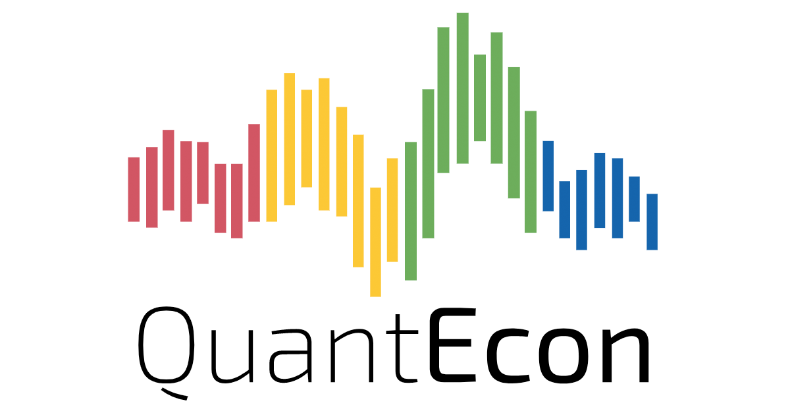
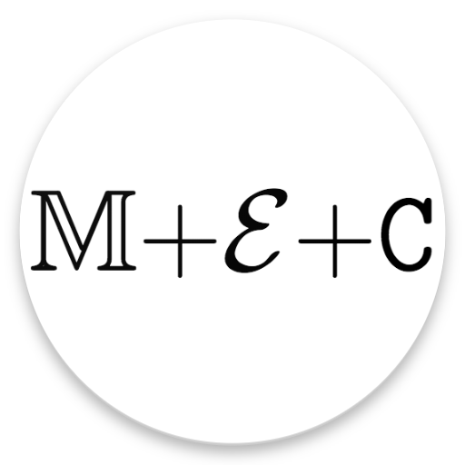
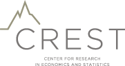
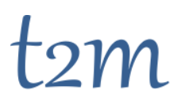

|       |  |
| ------------------------ | ------------------------ |

# Quantitative Economics Workshop

The first *Quantitative Economics Workshop* in Paris will take place on __September 12,13,14__ at the CREST.

Confirmed speakers include [Edouard Challe](https://sites.google.com/site/edouardchalle/) (EUI), [Beatrice Cherrier](https://beatricecherrier.wordpress.com/about/) (CREST), [Alfred Galichon](http://alfredgalichon.com/) (NYU Paris, [Math+Econ+Code](https://www.math-econ-code.org/)), [John Stachurski](https://johnstachurski.net/) (ANU/[QuantEcon](https://quantecon.org/)), [Pablo Winant](https://www.mosphere.fr) (ESCP/CREST/[T2M](https://www.t2m.network/))

The goal of the workshop is to stimulate community exchanges around the use of opensource tools for structural economics, especially at the new intersection of micro and macro models.

Participants will be acquainted with theory and practice of modern dynamic programming, the building blocks of heterogenous agents, as well as some elements of optimal transport problems in economics.

Mornings will be devoted to computational lectures that will systematically rely on interactive notebooks that students can run and modify. Examples will be shown in Python and/or Julia depending on the applications. A general familiarity with programming concepts is advised but Python or Julia. 

PhD students as well as interested researchers are welcome. Attendance is free, space permitting. If you wish to register or need any additional information please write to organizers@t2m.network. There is also a devoted budget to partially cover accomodation expenses for PhD students traveling to Paris, please contact us if you wish to to apply for it.

About our partners:
- [QuantEcon](https://quantecon.org/) is an organization, founded in 2016 by John Stachurski and Tom Sargent, for the promotion, documentation and development of open source code for economics, finance and related fields.  QuantEcon hosts online lectures, forums and community content, and also runs workshops on open source scientific computing.
- [Math+Econ+Code](https://www.math-econ-code.org/) is a series of online masterclasses at the interaction between mathematics, economics and computation ran by Alfred Galichon. 

---

## Preliminary Program

- __Day 1__: 

    - 9:00-12:30  Modern Dynamic Programming (John Stachurski)
        - Basic scientific computing in Python (Numpy / Scipy / Matplotlib)
        - Optimal stopping (    e.g., job search, American options)
        - Quick tour of modern dynamic programming (MDPs, recursive preferences, etc.)

    - 13:30-14:45 History lesson (Beatrice Cherrier)
        - "How computational resources changed the face of economics"
    
    - 15:00-16:00  Performance tricks for Dynamic Programming (John Stachurski)
        - Parallel programming on the GPU via JAX
        - Using the JIT compiler (Numba)
        - Parallel computing on the CPU (implicit multithreading in Numpy, Numba, JAX)
    
- __Day 2__:

    - 9:00-12:30  Solving Nonlinear Models with Julia (Pablo Winant)
        - perturbation analysis
        - time iteration, improved time-iteration
        - (endogenous grid points methods)

    - 13:30-14:45 (Mostly) Nontechnical Introduction to Heterogenous Agents Models (Edouard Challe)
        - "Individual risk, inequality, and monetary policy" 

    - 15:00-16:00 Solving Heterogenous Agents Models (Pablo Winant)

- __Day 3__:    

    - 9:00-12:30 Introduction to Optimal Transport (Alfred Galichon)

    - 13:30-14:45 Student presentations  

    - 15:00-16:00 Optimal Transport: Economic applications (Alfred Galichon)

---

## Sponsors:

|       |             |
| ------------------------------ | ------------------------ |
|              |    |
