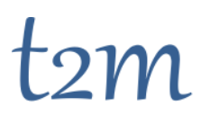

   

# Quantitative Economics Workshop

The first Quantitative Economics Workshop in Paris will take place ons September 12,13,14 at the CREST.

The goal of the workshop is to stimulate community exchanges around the use of opensource tools for structural economics, especially at the new intersection of micro and macro models.

Participants will be exposed to theory and practice of modern dynamic programming, the building blocks of heterogenous agents, as well as some elements of optimal transport problems in economics.

Mornings will be devoted to computational lectures that will systematically rely on interactive notebooks that students can run and modify. Examples will be shown in Python and/or Julia depending on the applications. A general familiarity with programming concepts is advised but Python or Julia knowledge is not required.

PhD students or researchers are equally welcome. Attendance is free but limited. If you wish to register or need any additional information please write to workshop@t2m.network

Confirmed speakers include Edouard Challe (EUI), Beatrice Cherrier (CREST), Alfred Gallichon (NYU Paris, [Math+Econ+Code](https://www.math-econ-code.org/)), John Stachurski (ANU/[QuantEcon](https://quantecon.org/)), Pablo Winant (ESCP/CREST/[T2M](https://www.t2m.network/))

  (Accomodation: I need to check how much I can promise there.)

About our partners:
- [QuantEcon](https://quantecon.org/) is an organization, founded in 2016 by John Stachurski and Tom Sargent, for the promotion, documentation and development of open source code for economics, finance and related fields.  QuantEcon hosts online lectures, forums and community content, and also runs workshops on open source scientific computing.

---

## Preliminary Program

- Day 1: 

    - 9:00-12:30  Modern Dynamic Programming (John Stachurski)
        - Basic scientific computing in Python (Numpy / Scipy / Matplotlib)
        - Optimal stopping (    e.g., job search, American options)
        - Quick tour of modern dynamic programming (MDPs, recursive preferences, etc.)

    - 13:30-14:45 History lesson (Beatrice Cherrier)
        "How computational resources changed the face of economics"
    
    - 15:00-16:00  Performance tricks for Dynamic Programming (John Stachurski)
        - Parallel programming on the GPU via JAX
        - Using the JIT compiler (Numba)
        - Parallel computing on the CPU (implicit multithreading in Numpy, Numba, JAX)
    
- Day 2:

    - 9:00-12:30  Solving Nonlinear Models with Julia (Pablo Winant)
        - time iteration variants
          - perturbation analysis
          - time iteration, improved time-iteration
          - (endogenous grid points methods)
        - towards heterogenous agents models

    - 13:30-14:45 (Mostly) Nontechnical Introduction to Heterogenous Agents Models: "Individual risk, inequality, and monetary policy" (Edouard Challe)

    - 15:00-16:00 Student presentations

- Day 3:    

    - 9:00-12:30 Introduction to Optimal Transport (Alfred Gallichon)

    - 13:30-14:45 Student presentations  

    - 15:00-16:00 Optimal Transport: Economic applications (Alfred Gallichon)

